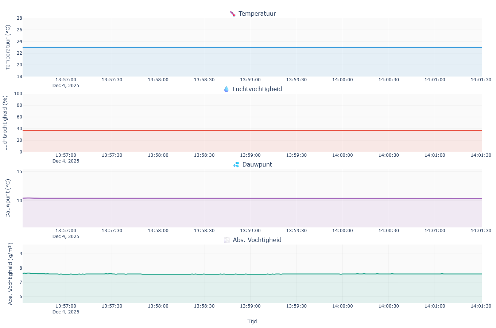
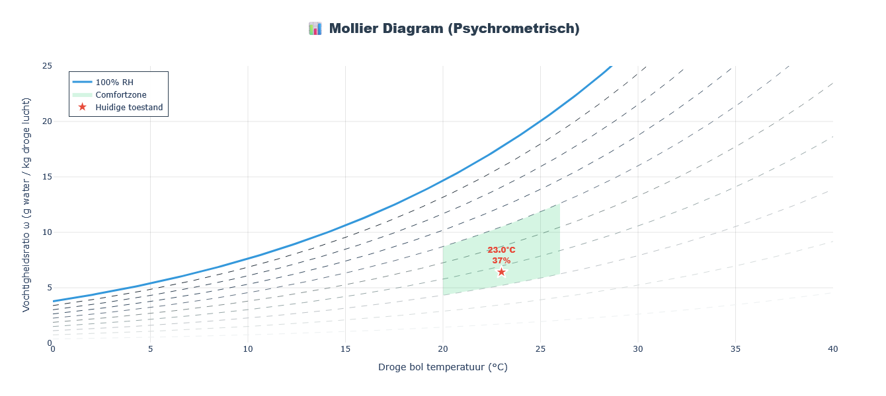
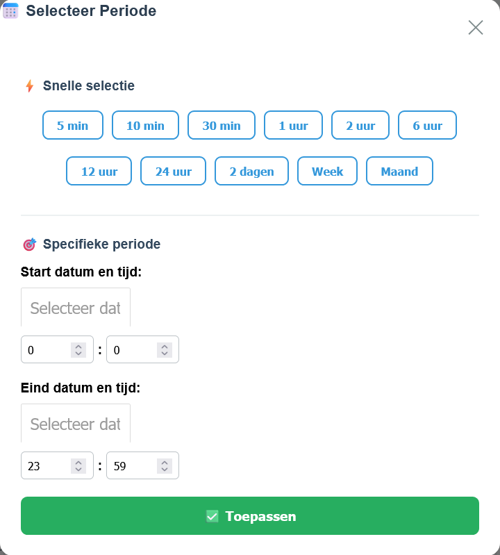

# XY-MD02 WebApp

[Nederlands](#nederlands) | [English](#english)

---

## Nederlands

Een professionele real-time klimaatmonitoring dashboard applicatie voor de XY-MD02 sensor die Modbus RTU data inleest, visualiseert en analyseert.

### Features

- **Real-time monitoring**: Live grafieken met automatische updates (1 seconde interval)
- **Historische data**: Persistente opslag in SQLite database met tijdsfilters (1 min tot 6 maanden)
- **Database optimalisaties**: Table-per-day partitioning, WAL mode, batch inserts voor multi-jaar operation
- **Data retentie**: Configureerbare automatische cleanup van oude data
- **Meerdere metingen**:
  - Temperatuur (°C)
  - Luchtvochtigheid (%)
  - Dauwpunt (berekend)
  - Absolute vochtigheid (g/m³)
  - Humidex (wetenschappelijke behagelijkheidsindex)
  - Behagelijkheidscore (0-6, gebaseerd op Humidex)
- **Psychrometrisch diagram**: Volledig Mollier diagram met verzadigingslijn, RH curves, comfortzone en live indicator
- **Historische data replay**: Tijdreizen door data met preset knoppen (5min-1maand) of custom datum/tijd selectie
- **Interactieve slider**: Live updates tijdens slepen voor vloeiende historische data navigatie
- **Wetenschappelijke analyse**: Humidex formule volgens Environment Canada standaard met August-Roche-Magnus vergelijking
- **Meertalig**: Nederlands en Engels, eenvoudig uitbreidbaar
- **Professionele UI**: Modern dashboard met gradient header en card-based layout
- **Zoom behoud**: Inzoomen op grafieken blijft behouden tijdens live updates
- **Robuust**: Uitgebreide input validatie en error handling
- **Configureerbaar**: Alle settings via `.env` bestand

### Screenshots

#### Live Grafieken

*Real-time monitoring van temperatuur, luchtvochtigheid, dauwpunt en absolute vochtigheid met automatische updates*

#### Psychrometrisch Diagram (Mollier)

*Interactief Mollier diagram met verzadigingslijn, RH curves, comfortzone en live indicator*

#### Historische Data Selectie

*Modal met preset knoppen en custom datum/tijd selectie voor historische data analyse*

### Requirements

- Python 3.8+
- Modbus RTU apparaat (RS485)
- Windows, Linux of macOS

### Installatie

1. **Clone de repository**
```bash
git clone <repository-url>
cd "Modbus Graph"
```

2. **Maak een virtual environment**
```bash
python -m venv .venv
```

3. **Activeer de virtual environment**

Windows PowerShell:
```powershell
.\.venv\Scripts\Activate.ps1
```

Windows CMD:
```cmd
.venv\Scripts\activate.bat
```

Linux/macOS:
```bash
source .venv/bin/activate
```

4. **Installeer dependencies**
```bash
pip install -r requirements.txt
```

5. **Configureer de applicatie**

Kopieer het voorbeeld configuratie bestand:
```bash
cp .env.example .env
```

Pas de instellingen aan in `.env`:
```env
# Modbus Settings
MODBUS_PORT=COM11
MODBUS_SLAVE_ID=1
MODBUS_BAUDRATE=9600
MODBUS_REGISTER_TEMP=1
MODBUS_REGISTER_HUMIDITY=2

# Database Settings
DATABASE_FILE=src/modbus_sensor_data.db
DATA_RETENTION_DAYS=0

# Application Settings
APP_HOST=127.0.0.1
APP_PORT=8050
APP_DEBUG=False
```

6. **Start de applicatie**
```bash
python app.py
```

De applicatie is nu beschikbaar op: `http://127.0.0.1:8050/`

### Projectstructuur

```
Modbus Graph/
├── app.py                    # Main entry point (45 regels)
├── database.py               # Database operaties, partitioning, WAL mode
├── modbus_reader.py          # Modbus RTU communicatie, batch buffering
├── psychrometric.py          # Mollier diagram generatie
├── callbacks.py              # Dash callbacks (7 functies)
├── layout.py                 # HTML layout en CSS styling
├── translations.py           # Meertalig systeem (NL/EN)
├── test_app.py               # Automated test suite (15 tests)
├── .env                      # Configuratie (niet in git)
├── .env.example              # Voorbeeld configuratie
├── requirements.txt          # Python dependencies
├── .gitignore               # Git exclude rules
├── README.md                # Deze file
└── src/                     # Data directory
    └── modbus_sensor_data.db  # SQLite database (niet in git)
```

### Configuratie

#### Modbus Settings

- `MODBUS_PORT`: Seriële poort (bijv. COM11, /dev/ttyUSB0)
- `MODBUS_SLAVE_ID`: Slave ID van het apparaat
- `MODBUS_BAUDRATE`: Baudrate (9600, 19200, etc.)
- `MODBUS_BYTESIZE`: Aantal data bits (8)
- `MODBUS_PARITY`: Parity bit (N = None, E = Even, O = Odd)
- `MODBUS_STOPBITS`: Stop bits (1, 2)
- `MODBUS_TIMEOUT`: Timeout in seconden
- `MODBUS_FUNCTION_CODE`: Modbus functie code (4 = Read Input Registers)
- `MODBUS_REGISTER_TEMP`: Register nummer voor temperatuur
- `MODBUS_REGISTER_HUMIDITY`: Register nummer voor luchtvochtigheid

#### Database Settings

- `DATABASE_FILE`: Pad naar de SQLite database file
- `DATA_RETENTION_DAYS`: Data retentie in dagen (0 = oneindig, anders aantal dagen dat data bewaard blijft)

#### Application Settings

- `APP_HOST`: Server host IP (127.0.0.1 voor lokaal)
- `APP_PORT`: Server poort (8050)
- `APP_DEBUG`: Debug mode (True/False)

### Nieuwe taal toevoegen

1. Open `translations.py`

2. Voeg de taal toe aan `LANGUAGE_NAMES`:
```python
LANGUAGE_NAMES = {
    'nl': 'Nederlands',
    'en': 'English',
    'de': 'Deutsch'  # Nieuw!
}
```

3. Voeg de vertalingen toe aan `TRANSLATIONS`:
```python
TRANSLATIONS = {
    'nl': { ... },
    'en': { ... },
    'de': {
        'title': 'Modbus Klimamonitor',
        'temperature': 'Temperatur',
        'humidity': 'Luftfeuchtigkeit',
        # ... alle andere keys
    }
}
```

De dropdown wordt automatisch bijgewerkt!

### Behagelijkheidsscore & Humidex

De applicatie gebruikt de **Humidex** (Humidity Index) voor wetenschappelijke behagelijkheidsberekening volgens Environment Canada standaard.

#### Humidex Formule
```
Humidex = T + 0.5555 × (e - 10)
```
waarbij:
- T = temperatuur in °C
- e = dampdrukverzadiging in hPa (berekend via August-Roche-Magnus vergelijking)

**August-Roche-Magnus vergelijking voor dampdruk:**
```
e = 6.11 × exp(5417.7530 × ((1/273.16) - (1/Td_kelvin)))
```
waar Td_kelvin = dauwpunt in Kelvin

#### Comfort classificatie op basis van Humidex:

- **< 20**: Te koud - Score 0
- **20-27**: Comfortabel koel - Score 4
- **27-30**: Comfortabel - Score 5
- **30-35**: Optimaal comfortabel - Score 6
- **35-40**: Enig ongemak - Score 3
- **40-46**: Veel ongemak, vermijd fysieke inspanning - Score 2
- **46-54**: Gevaarlijk, hittekrampen mogelijk - Score 1
- **> 54**: Heatstroke dreigend - Score 0

### Mollier Diagram (Psychrometric Chart)

De applicatie toont een interactief **psychrometrisch diagram** (Mollier diagram) met:

- **Verzadigingslijn**: 100% relatieve vochtigheid curve (zwarte lijn)
- **RH lijnen**: 10%, 20%, ..., 90% relatieve vochtigheid (grijze lijnen)
- **Comfortzone**: Groen gemarkeerd gebied (20-26°C, 30-60% RH)
- **Live indicator**: Real-time positie van huidige klimaatconditie (rode ster)
- **Historische positie**: Oranje marker bij gebruik van historische data replay
- **Vochtigheidsratio**: Y-as toont absolute vochtigheid in g water / kg droge lucht
- **Zoom & Pan**: Volledige Plotly interactiviteit voor gedetailleerde analyse

Dit diagram helpt om in één oogopslag te zien of de klimaatconditie binnen de comfortzone valt en hoe deze zich verhoudt tot verzadigingsgrenzen. Bij gebruik van de historische slider toont de oranje marker de positie op het geselecteerde tijdstip.

### Historische Data Replay

De applicatie biedt geavanceerde historische data analyse met twee invoermethoden:

#### **Preset Knoppen** (Snelle selectie)
Klik op **"Kies bereik voor historische analyse"** om de modal te openen met 11 preset knoppen:
- **5 min** - Laatste 5 minuten
- **10 min** - Laatste 10 minuten
- **30 min** - Laatste 30 minuten
- **1 uur** - Laatste uur
- **2 uur** - Laatste 2 uur
- **6 uur** - Laatste 6 uur
- **12 uur** - Laatste 12 uur
- **24 uur** - Laatste dag
- **2 dagen** - Laatste 2 dagen
- **Week** - Laatste week
- **Maand** - Laatste maand

#### **Custom Range** (Precisie selectie)
- Klik in de modal op **"Custom..."** om een aangepaste periode in te stellen
- Kies start datum en tijd met uur:minuut precisie
- Kies eind datum en tijd met uur:minuut precisie
- Ondersteunt dezelfde dag selectie voor start en eind
- Uur selectie: 00-23
- Minuut selectie: 00-59
- Validatie: start tijd moet vóór eind tijd liggen

#### **Interactieve Tijdlijn Slider**
- Na selectie van een periode verschijnt een **live-updating slider**
- Sleep de slider om terug te "reizen" door de tijd
- **Live updates tijdens slepen**: Het diagram updatet direct zonder de muis los te laten
- Het **psychrometrisch diagram** toont de positie van de klimaatconditie op dat moment (oranje marker)
- Timestamp wordt live weergegeven in DD-MM HH:MM formaat
- Vloeiende navigatie door historische data voor gedetailleerde analyse

#### **Gescheiden Live & Historische Data**
- **Live grafieken** (temperatuur, vochtigheid) blijven altijd real-time updates tonen
- **Mollier diagram** schakelt tussen live mode (rode ster) en historische mode (oranje marker)
- Geen interferentie tussen live monitoring en historische analyse

**Gebruik:**
1. Klik op **"Kies bereik voor historische analyse"** knop onder het Mollier diagram
2. Kies een preset knop voor snelle analyse of "Custom..." voor specifieke datum/tijd
3. Gebruik de **live-updating slider** om vloeiend door de historische data te navigeren
4. Bekijk hoe de klimaatconditie veranderde over tijd in het Mollier diagram
5. Live grafieken bovenaan blijven gewoon real-time data tonen

### Database Architectuur

#### Optimalisaties (v2.0.0)

De applicatie gebruikt geavanceerde SQLite optimalisaties voor multi-jaar continuous operation:

**Table-per-day Partitioning:**
- Dynamische tabel creatie: `measurements_YYYYMMDD` (bijv. `measurements_20251205`)
- Automatische table switching om middernacht
- UNION ALL queries over relevante dag-tabellen
- Smart table selection op basis van tijdsbereik
- Instant cleanup via DROP TABLE (milliseconden vs minuten voor DELETE+VACUUM)

**Write Optimizations:**
- WAL mode (Write-Ahead Logging) voor betere concurrent performance
- PRAGMA synchronous=NORMAL voor snellere commits
- PRAGMA temp_store=MEMORY voor temporary data in RAM
- Batch inserts: 30-measurement buffer (30 seconden)
- Persistent connection pooling in Modbus thread
- 97% reductie in write transactions (86k/dag → 2.9k/dag)

**Storage Optimizations:**
- Integer epoch timestamps i.p.v. TEXT datetime (50% space saving)
- Geïndexeerde timestamp kolommen per tabel
- Configureerbare data retention met automatische cleanup

**Performance Voordelen:**
- Queries scannen alleen relevante dagen (niet hele database)
- 10-100× snellere batch inserts vs per-second commits
- Geen table bloat over tijd door partitioning
- Sub-milliseconde table drops voor oude data
- Lineaire performance onafhankelijk van dataset grootte

#### Database Schema (per tabel)

```sql
CREATE TABLE measurements_YYYYMMDD (
    id INTEGER PRIMARY KEY AUTOINCREMENT,
    timestamp INTEGER NOT NULL,  -- Unix epoch timestamp
    temperature REAL NOT NULL,
    humidity REAL NOT NULL,
    dewpoint REAL,
    absolute_humidity REAL
);
CREATE INDEX idx_measurements_YYYYMMDD_timestamp ON measurements_YYYYMMDD(timestamp);
```

### Testing

De applicatie bevat een geautomatiseerde test suite:

```bash
python test_app.py
```

**Test Coverage:**
- Berekeningen: Dauwpunt, absolute vochtigheid, Humidex formules
- Database: CRUD operaties, queries, partitioned tables, integer timestamps
- Vertalingen: NL/EN key pariteit en volledigheid
- Psychrometrisch diagram: Chart generatie, meertaligheid
- Data validatie: Temperatuur en vochtigheid ranges
- Productie database: Verificatie van database bestaan en structuur

Alle 15 tests moeten slagen voordat nieuwe features worden gecommit.

### Development

#### Requirements.txt genereren
```bash
pip freeze > requirements.txt
```

#### Code Structuur (Modular Architecture v2.0.0)

De codebase is gemodulariseerd voor betere onderhoudbaarheid:

- **app.py** (45 regels): Clean entry point met app initialisatie
- **database.py** (190 regels): Table-per-day partitioning, WAL mode, UNION queries, cleanup
- **modbus_reader.py** (185 regels): Modbus RTU communicatie, batch buffering, validation
- **psychrometric.py** (317 regels): Mollier diagram generatie (current + historical)
- **callbacks.py** (636 regels): 7 Dash callbacks voor UI interactie
- **layout.py**: UI componenten, modal system, styling
- **translations.py**: Vertaalsysteem (NL/EN)
- **test_app.py** (320 regels): Automated test suite (15 tests)

**Dependency Flow:**
```
app.py
├── database.py (standalone)
├── modbus_reader.py → database.py
├── psychrometric.py → translations.py
├── callbacks.py → database.py, psychrometric.py, translations.py
└── layout.py → translations.py
```

### Troubleshooting

#### Modbus connectie problemen
- Controleer of de seriële poort correct is (`MODBUS_PORT` in `.env`)
- Verifieer de baudrate en andere seriële instellingen
- Controleer de register nummers in de apparaat documentatie

#### Database errors
- Zorg dat de `src/` folder bestaat
- Controleer schrijfrechten in de project folder

#### Port al in gebruik
- Wijzig `APP_PORT` in `.env` naar een andere poort

### Version History

#### v2.0.0 (December 5, 2025) - Performance & Architecture
- **Database Optimizations**:
  - Table-per-day partitioning (measurements_YYYYMMDD)
  - WAL mode for concurrent read/write performance
  - Integer epoch timestamps (50% space reduction)
  - Batch inserts: 30-measurement buffer (97% transaction reduction)
  - UNION ALL queries over relevant tables
  - Instant cleanup via DROP TABLE
  - Connection pooling in Modbus thread
- **Code Modularization**:
  - Split 1225-line app.py into 5 focused modules
  - database.py: 190 lines (partitioning, WAL, queries)
  - modbus_reader.py: 185 lines (RTU communication, buffering)
  - psychrometric.py: 317 lines (Mollier diagrams)
  - callbacks.py: 636 lines (7 Dash callbacks)
  - app.py: 45 lines (clean entry point)
- **Performance Results**:
  - 10-100× faster write performance
  - 50% storage space reduction
  - Sub-millisecond cleanup operations
  - Linear scaling for multi-year operation
  - Queries only scan relevant day-tables
- **Testing**: All 15 automated tests passing

#### v1.1.0 (December 4, 2025) - Features
- Humidex calculation (Environment Canada standard)
- Psychrometric chart (Mollier diagram)
- Historical data replay with modal interface
- 11 preset buttons + custom date/time picker
- Live slider updates
- Automated test suite (15 tests)
- Improved UX and bug fixes

#### v1.0.0 (Initial Release)
- Real-time monitoring with live graphs
- SQLite database with persistent storage
- Multi-language support (NL/EN)
- Temperature, humidity, dewpoint, absolute humidity measurements
- Configurable data retention
- Professional dashboard UI

### Licentie

Dit project is open source en beschikbaar onder de [MIT License](LICENSE).

---

## English

A professional real-time climate monitoring dashboard application for the XY-MD02 sensor that reads, visualizes, and analyzes Modbus RTU data.

### Features

- **Real-time monitoring**: Live charts with automatic updates (1 second interval)
- **Historical data**: Persistent storage in SQLite database with time filters (1 min to 6 months)
- **Database optimizations**: Table-per-day partitioning, WAL mode, batch inserts for multi-year operation
- **Data retention**: Configurable automatic cleanup of old data
- **Multiple measurements**:
  - Temperature (°C)
  - Humidity (%)
  - Dew Point (calculated)
  - Absolute Humidity (g/m³)
  - Humidex (scientific comfort index)
  - Comfort Score (0-6, based on Humidex)
- **Psychrometric chart**: Mollier diagram with live indicator and comfort zone visualization
- **Historical data replay**: Time-travel through data with preset buttons or custom date/time selection
- **Interactive slider**: Live updates while dragging for smooth historical navigation
- **Scientific analysis**: Humidex formula according to Environment Canada standard
- **Multilingual**: Dutch and English, easily expandable
- **Professional UI**: Modern dashboard with gradient header and card-based layout
- **Zoom persistence**: Graph zoom stays preserved during live updates
- **Robust**: Extensive input validation and error handling
- **Configurable**: All settings via `.env` file

### Screenshots

#### Live Graphs

*Real-time monitoring of temperature, humidity, dew point and absolute humidity with automatic updates*

#### Psychrometric Chart (Mollier)

*Interactive Mollier diagram with saturation line, RH curves, comfort zone and live indicator*

#### Historical Data Selection

*Modal with preset buttons and custom date/time picker for historical data analysis*

### Requirements

- Python 3.8+
- Modbus RTU device (RS485)
- Windows, Linux or macOS

### Installation

1. **Clone the repository**
```bash
git clone <repository-url>
cd "Modbus Graph"
```

2. **Create a virtual environment**
```bash
python -m venv .venv
```

3. **Activate the virtual environment**

Windows PowerShell:
```powershell
.\.venv\Scripts\Activate.ps1
```

Windows CMD:
```cmd
.venv\Scripts\activate.bat
```

Linux/macOS:
```bash
source .venv/bin/activate
```

4. **Install dependencies**
```bash
pip install -r requirements.txt
```

5. **Configure the application**

Copy the example configuration file:
```bash
cp .env.example .env
```

Adjust the settings in `.env`:
```env
# Modbus Settings
MODBUS_PORT=COM11
MODBUS_SLAVE_ID=1
MODBUS_BAUDRATE=9600
MODBUS_REGISTER_TEMP=1
MODBUS_REGISTER_HUMIDITY=2

# Database Settings
DATABASE_FILE=src/modbus_sensor_data.db
DATA_RETENTION_DAYS=0

# Application Settings
APP_HOST=127.0.0.1
APP_PORT=8050
APP_DEBUG=False
```

6. **Start the application**
```bash
python app.py
```

The application is now available at: `http://127.0.0.1:8050/`

### Project Structure

```
Modbus Graph/
├── app.py                    # Main entry point (45 lines)
├── database.py               # Database operations, partitioning, WAL mode
├── modbus_reader.py          # Modbus RTU communication, batch buffering
├── psychrometric.py          # Mollier diagram generation
├── callbacks.py              # Dash callbacks (7 functions)
├── layout.py                 # HTML layout and CSS styling
├── translations.py           # Multilingual system (NL/EN)
├── test_app.py               # Automated test suite (15 tests)
├── .env                      # Configuration (not in git)
├── .env.example              # Example configuration
├── requirements.txt          # Python dependencies
├── .gitignore               # Git exclude rules
├── README.md                # This file
└── src/                     # Data directory
    └── modbus_sensor_data.db  # SQLite database (not in git)
```

### Configuration

#### Modbus Settings

- `MODBUS_PORT`: Serial port (e.g. COM11, /dev/ttyUSB0)
- `MODBUS_SLAVE_ID`: Slave ID of the device
- `MODBUS_BAUDRATE`: Baudrate (9600, 19200, etc.)
- `MODBUS_BYTESIZE`: Number of data bits (8)
- `MODBUS_PARITY`: Parity bit (N = None, E = Even, O = Odd)
- `MODBUS_STOPBITS`: Stop bits (1, 2)
- `MODBUS_TIMEOUT`: Timeout in seconds
- `MODBUS_FUNCTION_CODE`: Modbus function code (4 = Read Input Registers)
- `MODBUS_REGISTER_TEMP`: Register number for temperature
- `MODBUS_REGISTER_HUMIDITY`: Register number for humidity

#### Database Settings

- `DATABASE_FILE`: Path to the SQLite database file
- `DATA_RETENTION_DAYS`: Data retention in days (0 = infinite, otherwise number of days to keep data)

#### Application Settings

- `APP_HOST`: Server host IP (127.0.0.1 for local)
- `APP_PORT`: Server poort (8050)
- `APP_DEBUG`: Debug mode (True/False)

### Adding a New Language

1. Open `translations.py`

2. Add the language to `LANGUAGE_NAMES`:
```python
LANGUAGE_NAMES = {
    'nl': 'Nederlands',
    'en': 'English',
    'de': 'Deutsch'  # New!
}
```

3. Add the translations to `TRANSLATIONS`:
```python
TRANSLATIONS = {
    'nl': { ... },
    'en': { ... },
    'de': {
        'title': 'Modbus Klimamonitor',
        'temperature': 'Temperatur',
        'humidity': 'Luftfeuchtigkeit',
        # ... all other keys
    }
}
```

The dropdown will be updated automatically!

### Comfort Score & Humidex

The application uses the **Humidex** (Humidity Index) for scientific comfort calculation according to Environment Canada standard.

#### Humidex Formula
```
Humidex = T + 0.5555 × (e - 10)
```
where:
- T = temperature in °C
- e = vapor pressure saturation in hPa (calculated via dew point)

#### Comfort classification based on Humidex:

- **< 20**: Too cold - Score 0
- **20-27**: Comfortably cool - Score 4
- **27-30**: Comfortable - Score 5
- **30-35**: Optimally comfortable - Score 6
- **35-40**: Some discomfort - Score 3
- **40-46**: Great discomfort, avoid physical exertion - Score 2
- **46-54**: Dangerous, heat cramps possible - Score 1
- **> 54**: Heat stroke imminent - Score 0

### Mollier Diagram (Psychrometric Chart)

The application displays an interactive **psychrometric chart** with:

- **Saturation line**: 100% relative humidity curve
- **RH lines**: 10%, 20%, ..., 90% relative humidity
- **Comfort zone**: Marked area (20-26°C, 30-60% RH)
- **Live indicator**: Real-time position of current climate condition (red star)
- **Historical marker**: Orange marker when using historical replay
- **Humidity ratio**: Y-axis shows absolute humidity in g water / kg dry air
- **Zoom & Pan**: Full Plotly interactivity for detailed analysis

This diagram helps to see at a glance whether the climate condition is within the comfort zone and how it relates to saturation limits.

### Historical Data Replay

The application offers advanced historical data analysis with two input methods:

#### **Preset Buttons** (Quick selection)
- **5 min** - Last 5 minutes
- **10 min** - Last 10 minutes
- **30 min** - Last 30 minutes
- **1 hour** - Last hour
- **2 hours** - Last 2 hours
- **6 hours** - Last 6 hours
- **12 hours** - Last 12 hours
- **24 hours** - Last day
- **2 days** - Last 2 days
- **Week** - Last week
- **Month** - Last month

#### **Custom Range** (Precision selection)
- Click the **"Custom..."** button to open a modal
- Choose start date and time (hour:minute)
- Choose end date and time (hour:minute)
- Supports same day selection for start and end
- Hour selection: 0-23
- Minute selection: 0-59

#### **Timeline Slider**
- After selecting a period, an **interactive slider** appears
- Drag the slider to "travel" back through time
- **Live updates while dragging**: Chart updates immediately without releasing mouse
- The **psychrometric chart** shows the climate condition position at that moment
- Timestamp is displayed live in DD-MM HH:MM format

**Usage:**
1. Click a preset button for quick analysis
2. Or click "Custom..." for specific date/time selection
3. Use the slider to navigate through historical data
4. See how the climate condition changed over time in the Mollier diagram

### Database Architecture

#### Optimizations (v2.0.0)

The application uses advanced SQLite optimizations for multi-year continuous operation:

**Table-per-day Partitioning:**
- Dynamic table creation: `measurements_YYYYMMDD` (e.g. `measurements_20251205`)
- Automatic table switching at midnight
- UNION ALL queries across relevant day-tables
- Smart table selection based on timerange
- Instant cleanup via DROP TABLE (milliseconds vs minutes for DELETE+VACUUM)

**Write Optimizations:**
- WAL mode (Write-Ahead Logging) for better concurrent performance
- PRAGMA synchronous=NORMAL for faster commits
- PRAGMA temp_store=MEMORY for temporary data in RAM
- Batch inserts: 30-measurement buffer (30 seconds)
- Persistent connection pooling in Modbus thread
- 97% reduction in write transactions (86k/day → 2.9k/day)

**Storage Optimizations:**
- Integer epoch timestamps instead of TEXT datetime (50% space saving)
- Indexed timestamp columns per table
- Configurable data retention with automatic cleanup

**Performance Benefits:**
- Queries only scan relevant days (not entire database)
- 10-100× faster batch inserts vs per-second commits
- No table bloat over time due to partitioning
- Sub-millisecond table drops for old data
- Linear performance independent of dataset size

#### Database Schema (per table)

```sql
CREATE TABLE measurements_YYYYMMDD (
    id INTEGER PRIMARY KEY AUTOINCREMENT,
    timestamp INTEGER NOT NULL,  -- Unix epoch timestamp
    temperature REAL NOT NULL,
    humidity REAL NOT NULL,
    dewpoint REAL,
    absolute_humidity REAL
);
CREATE INDEX idx_measurements_YYYYMMDD_timestamp ON measurements_YYYYMMDD(timestamp);
```

### Testing

The application includes an automated test suite:

```bash
python test_app.py
```

**Test Coverage:**
- Calculations: Dew point, absolute humidity, Humidex formulas
- Database: CRUD operations, queries, partitioned tables, integer timestamps
- Translations: NL/EN key parity and completeness
- Psychrometric chart: Chart generation, multi-language support
- Data validation: Temperature and humidity ranges
- Production database: Database existence and structure verification

All 15 tests must pass before committing new features.

### Development

#### Generating requirements.txt
```bash
pip freeze > requirements.txt
```

#### Code Structure (Modular Architecture v2.0.0)

The codebase has been modularized for better maintainability:

- **app.py** (45 lines): Clean entry point with app initialization
- **database.py** (190 lines): Table-per-day partitioning, WAL mode, UNION queries, cleanup
- **modbus_reader.py** (185 lines): Modbus RTU communication, batch buffering, validation
- **psychrometric.py** (317 lines): Mollier diagram generation (current + historical)
- **callbacks.py** (636 lines): 7 Dash callbacks for UI interaction
- **layout.py**: UI components, modal system, styling
- **translations.py**: Translation system (NL/EN)
- **test_app.py** (320 lines): Automated test suite (15 tests)

**Dependency Flow:**
```
app.py
├── database.py (standalone)
├── modbus_reader.py → database.py
├── psychrometric.py → translations.py
├── callbacks.py → database.py, psychrometric.py, translations.py
└── layout.py → translations.py
```

### Troubleshooting

#### Modbus connection problems
- Check if the serial port is correct (`MODBUS_PORT` in `.env`)
- Verify the baudrate and other serial settings
- Check the register numbers in the device documentation

#### Database errors
- Ensure the `src/` folder exists
- Check write permissions in the project folder

#### Port already in use
- Change `APP_PORT` in `.env` to another port

### Version History

#### v2.0.0 (December 5, 2025) - Performance & Architecture
- **Database Optimizations**:
  - Table-per-day partitioning (measurements_YYYYMMDD)
  - WAL mode for concurrent read/write performance
  - Integer epoch timestamps (50% space reduction)
  - Batch inserts: 30-measurement buffer (97% transaction reduction)
  - UNION ALL queries over relevant tables
  - Instant cleanup via DROP TABLE
  - Connection pooling in Modbus thread
- **Code Modularization**:
  - Split 1225-line app.py into 5 focused modules
  - database.py: 190 lines (partitioning, WAL, queries)
  - modbus_reader.py: 185 lines (RTU communication, buffering)
  - psychrometric.py: 317 lines (Mollier diagrams)
  - callbacks.py: 636 lines (7 Dash callbacks)
  - app.py: 45 lines (clean entry point)
- **Performance Results**:
  - 10-100× faster write performance
  - 50% storage space reduction
  - Sub-millisecond cleanup operations
  - Linear scaling for multi-year operation
  - Queries only scan relevant day-tables
- **Testing**: All 15 automated tests passing

#### v1.1.0 (December 4, 2025) - Features
- Humidex calculation (Environment Canada standard)
- Psychrometric chart (Mollier diagram)
- Historical data replay with modal interface
- 11 preset buttons + custom date/time picker
- Live slider updates
- Automated test suite (15 tests)
- Improved UX and bug fixes

#### v1.0.0 (Initial Release)
- Real-time monitoring with live graphs
- SQLite database with persistent storage
- Multi-language support (NL/EN)
- Temperature, humidity, dewpoint, absolute humidity measurements
- Configurable data retention
- Professional dashboard UI

### License

This project is open source and available under the [MIT License](LICENSE).
